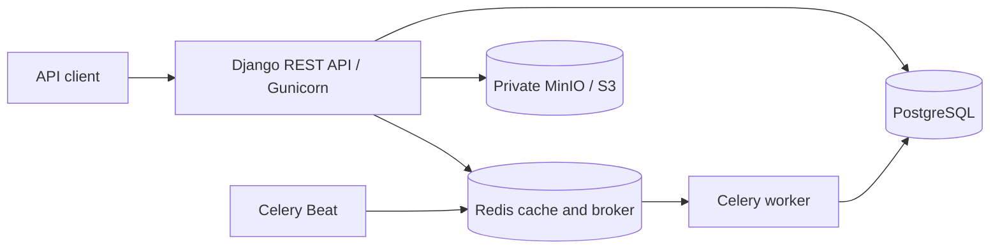
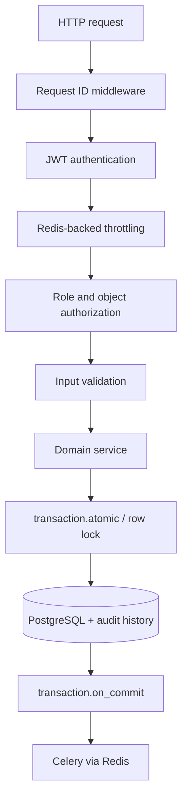
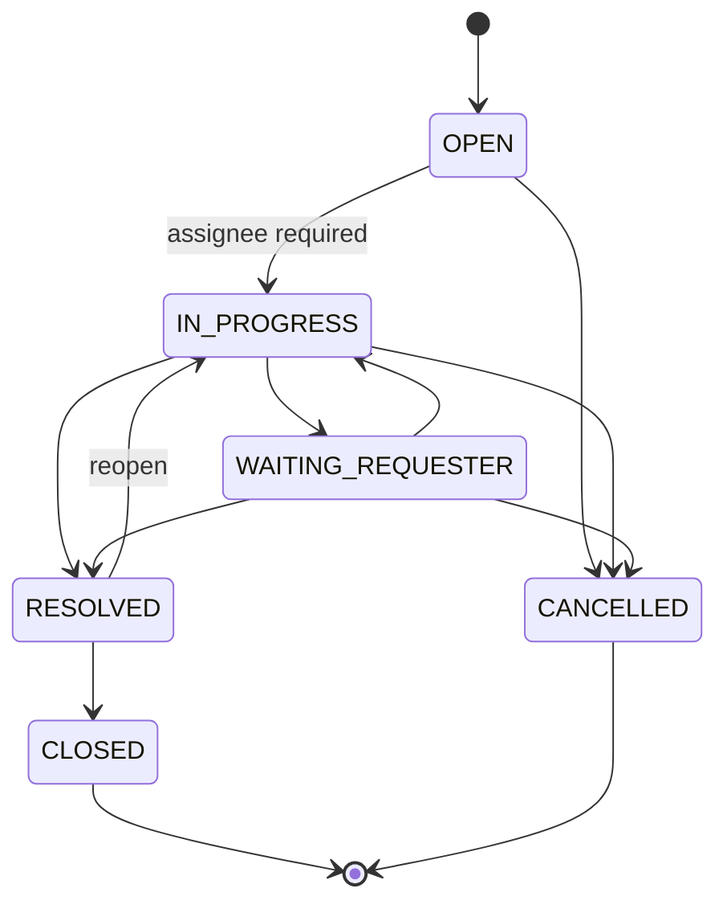

# ServiceFlow API

[](https://github.com/ldmrtnll-arch/serviceflow-api/actions/workflows/ci.yml)


[](LICENSE)

A production-oriented REST API for ticket management and support workflows, built with Django
and Django REST Framework.

ServiceFlow API goes beyond CRUD: it combines an explicit ticket state machine, object-level
authorization, persisted SLA commitments, transactional audit history, asynchronous processing,
private S3-compatible attachments, request correlation, API hardening, and measured performance.
The repository is Docker-first and includes reproducible seeds, tests, API documentation, and
load tooling.

## Features

### Authentication and authorization

- Email-based JWT authentication with access and refresh tokens.
- `requester`, `agent`, and `admin` roles.
- Requester isolation enforced by the base ticket queryset.
- Domain-level permission checks for assignment and state transitions.

### Ticket workflow

- Explicit status transitions instead of unrestricted status updates.
- Concurrency-safe assignment and take-ownership operations.
- Comments, immutable audit history, filtering, search, ordering, and pagination.
- Public UUID identifiers for tickets and attachments.

### SLA management

- Persisted first-response and resolution policies per priority.
- Deadlines frozen when a ticket is created and intentionally recalculated on priority changes.
- Idempotent breach detection executed periodically by Celery Beat.
- SLA status filters and operational metrics.

### Attachments

- Multipart upload with filename, extension, MIME, and size validation.
- Streaming SHA-256 calculation and collision-resistant UUID object keys.
- Private MinIO/S3-compatible storage with temporary signed downloads.
- Compensating cleanup when PostgreSQL and object-storage operations cannot commit atomically.

### Reliability and operations

- PostgreSQL transactions and row locks for state-changing operations.
- Redis-backed Celery, cache, and throttling.
- Structured JSON logs, `X-Request-ID`, slow-request events, and HTTP-to-Celery correlation.
- Liveness/readiness endpoints, sanitized errors, bounded retries, and hardened containers.
- Query-budget regression tests, PostgreSQL plan review, and a Locust workload.

## Tech Stack

| Layer | Technology |
|---|---|
| Backend | Python 3.12, Django 5, Django REST Framework |
| Database | PostgreSQL 16 |
| Async and cache | Celery, Celery Beat, Redis |
| Object storage | MinIO locally; S3-compatible adapter |
| Authentication | SimpleJWT / JWT |
| API documentation | drf-spectacular, OpenAPI, Swagger UI |
| Testing | pytest, pytest-django, coverage |
| Quality and security | Ruff, pip-audit, Django deployment checks |
| Containers and CI | Docker Compose, Gunicorn, GitHub Actions |
| Load testing | Locust |

## Architecture

ServiceFlow API is a modular Django monolith. The domain fits coherently in one deployable process,
while `accounts`, `tickets`, configuration, and infrastructure concerns remain separated. This
keeps local and production operations understandable without preventing future extraction of a
module if scale or ownership boundaries justify it.



State-changing requests follow an explicit service-layer path:



See [Architecture](docs/architecture.md) for the domain model, request lifecycle, consistency
boundaries, and engineering decisions.

## Project Structure

```text
apps/
├── accounts/                 custom user, roles, authentication
└── tickets/                  models, services, SLA, storage, tasks, API
    └── management/commands/  development and performance seeds
config/                       settings, URLs, Celery, errors, observability
tests/                        domain and API integration tests
loadtests/                    authenticated Locust workload
docs/                         architecture, demo, and release material
```

## Domain Model

- **User** — email-based identity with requester, agent, or admin role.
- **Ticket** — workflow aggregate with requester, optional assignee, priority, status, and SLA data.
- **TicketCategory** — administrative classification referenced by tickets.
- **TicketComment** — user-authored conversation entry; the first operator comment completes the
  first-response SLA.
- **TicketHistory** — append-only audit entry for important domain changes.
- **SLAPolicy** — one active first-response/resolution policy per priority.
- **TicketAttachment** — PostgreSQL metadata for a private object stored outside the database.

## Roles and Ticket Workflow

- **requester** — creates tickets, sees only their own tickets, comments, edits safe fields while
  open, and may cancel an active ticket.
- **agent** — sees operational tickets, takes ownership, comments, updates safe fields, and performs
  allowed transitions.
- **admin** — has operational access, can reassign tickets, and manages categories and SLA policies.



Closed and cancelled tickets are terminal. Workflow fields and timestamps are server-controlled;
clients use explicit actions rather than assigning arbitrary state.

## SLA Management

The development seed creates these elapsed-time policies:

| Priority | First response | Resolution |
|---|---:|---:|
| Low | 24 h | 120 h |
| Medium | 8 h | 72 h |
| High | 4 h | 24 h |
| Urgent | 1 h | 8 h |

Ticket creation resolves the active policy and persists both deadlines. Later policy edits do not
rewrite existing commitments; an explicit priority change recalculates deadlines from the original
creation time. The first agent/admin comment records `first_responded_at`, and
`first_resolved_at` permanently captures the first resolution even when a ticket is reopened.

Celery Beat selects overdue candidates every minute. Each candidate is locked and rechecked before
writing its breach timestamp, history, and post-commit notification, so repeated or overlapping
runs do not duplicate the breach.

## Attachments

PostgreSQL stores attachment metadata and audit records; MinIO/S3 stores binary content in a
private bucket. API responses never expose object keys, and lists do not generate signed URLs.
Authorized download actions return five-minute presigned URLs.

Uploads accept PDF, PNG, JPEG, TXT, CSV, DOCX, and XLSX up to 10 MiB by default. UUID keys prevent
path traversal and filename collisions. If object upload succeeds but database persistence fails,
the object is deleted as compensation. Deletion commits metadata first and performs object cleanup
after commit; failures are logged for later orphan handling.

## Observability

Every response includes `X-Request-ID`. Valid client identifiers are accepted; invalid or oversized
values are replaced by UUIDs. A `ContextVar` keeps concurrent request/task context isolated, and
Celery headers propagate the identifier from HTTP publication to worker execution.

Logs are JSON, timestamped in UTC, and include relevant HTTP or task fields without request bodies,
tokens, cookies, or storage credentials. Requests above the configurable threshold emit
`slow_http_request`.

```json
{
  "timestamp": "2026-08-28T10:42:38.161100+00:00",
  "level": "INFO",
  "logger": "serviceflow.tasks",
  "event": "celery_task_started",
  "request_id": "demo-request-001",
  "task_name": "apps.tickets.tasks.notify_ticket_event",
  "task_id": "00000000-0000-0000-0000-000000000000"
}
```

## Reliability and Resilience

- `transaction.atomic()` keeps domain state and audit records together.
- `select_for_update()` prevents assignment and transition races.
- `transaction.on_commit()` prevents async publication for rolled-back changes.
- Broker publication failures are logged without invalidating committed API operations.
- Celery retries transient database failures with bounded backoff.
- S3 calls use bounded adaptive retries and connection/read timeouts.
- Attachment compensation handles the PostgreSQL/S3 consistency boundary explicitly.
- `/health/ready/` treats PostgreSQL as essential and Redis as degradable.

## Security

Implemented controls include JWT authentication, role and object authorization, requester data
isolation, Redis-backed throttling, file allowlists, a private object bucket, expiring signed URLs,
sanitized production errors, secure production-setting defaults, non-root containers, and
dependency auditing. These are concrete controls, not a claim that any deployment is automatically
secure; proxy trust, secret management, TLS, monitoring, and infrastructure policies remain
deployment responsibilities.

## Performance

Measurements below were collected locally during the hardening phase and are not production
benchmarks.

### Query efficiency

- Ticket page: **2 SQL queries for 20 tickets**.
- Regression budget: **no more than 4 queries with 30 tickets**.
- Related users/categories are joined and attachment counts are annotated to prevent N+1 queries.

### PostgreSQL query plans

| Query | Local execution time |
|---|---:|
| Status + newest tickets | 0.054 ms |
| Priority + newest tickets | 0.039 ms |
| SLA candidates | 0.106 ms |

### Load test

| Metric | Result |
|---|---:|
| Users | 10 |
| Duration | 30 s |
| Requests | 285 |
| Failures | 0 |
| Requests/s | 9.68 |
| p50 | 13 ms |
| p95 | 26 ms |
| p99 | 150 ms |

These results represent a local development environment and are not production benchmarks.

## Getting Started

### Requirements

- Git
- Docker with Docker Compose v2

### 1. Clone

```bash
git clone https://github.com/ldmrtnll-arch/serviceflow-api.git
cd serviceflow-api
```

### 2. Optional environment file

The Compose defaults work without a local `.env`. Copy the example when you want a documented
starting point for customization.

Linux/macOS:

```bash
cp .env.example .env
```

PowerShell:

```powershell
Copy-Item .env.example .env
```

All example secrets and credentials are development-only.

### 3. Start the stack

```bash
docker compose up -d --build
```

The API container automatically applies migrations before Gunicorn starts. To run them explicitly:

```bash
docker compose exec api python manage.py migrate
```

### 4. Seed development data

```bash
docker compose exec api python manage.py seed_dev
```

`seed_dev` is idempotent. It creates these **development-only** accounts with password
`ServiceFlow123!`:

- `requester@serviceflow.local`
- `agent@serviceflow.local`
- `admin@serviceflow.local`

### 5. Open Swagger

Swagger UI is the fastest way to explore the authenticated workflow:
<http://localhost:8000/api/docs/>.

## Local Services

| Service | URL / purpose |
|---|---|
| API | <http://localhost:8000> |
| Swagger UI | <http://localhost:8000/api/docs/> |
| OpenAPI schema | <http://localhost:8000/api/schema/> |
| Liveness | <http://localhost:8000/health/> |
| Readiness | <http://localhost:8000/health/ready/> |
| MinIO console | <http://localhost:9001> |

| Compose service | Purpose |
|---|---|
| `api` | Django/Gunicorn API and automatic migrations |
| `db` | PostgreSQL relational database |
| `redis` | Celery broker/backend, cache, and throttling |
| `worker` | Asynchronous notification and SLA processing |
| `beat` | Periodic SLA scheduling |
| `minio` | Private local object storage |
| `minio-init` | Idempotent bucket initialization |

## API Quick Start

Login and copy the returned access token:

```bash
curl -X POST http://localhost:8000/api/v1/auth/login/ \
  -H "Content-Type: application/json" \
  -d '{"email":"requester@serviceflow.local","password":"ServiceFlow123!"}'
```

Set `TOKEN` and use a category ID returned by `GET /api/v1/categories/`:

```bash
TOKEN="<access-token>"
CATEGORY_ID="<category-id>"

curl -X POST http://localhost:8000/api/v1/tickets/ \
  -H "Authorization: Bearer $TOKEN" \
  -H "Content-Type: application/json" \
  -d "{\"title\":\"VPN access\",\"description\":\"Unable to connect\",\"priority\":\"high\",\"category\":$CATEGORY_ID}"

curl http://localhost:8000/api/v1/tickets/ \
  -H "Authorization: Bearer $TOKEN"
```

Upload an allowed attachment to an accessible, non-terminal ticket:

```bash
curl -X POST http://localhost:8000/api/v1/tickets/<ticket-uuid>/attachments/ \
  -H "Authorization: Bearer $TOKEN" \
  -F "file=@evidence.pdf;type=application/pdf"
```

For a complete interview-sized walkthrough, see [Demo Guide](docs/demo.md). A ready-to-edit VS Code
REST Client collection is available at [serviceflow.http](docs/serviceflow.http).

## API Overview

| Area | Endpoints |
|---|---|
| Authentication | `POST /api/v1/auth/register/`, `login/`, `token/refresh/`; `GET me/` |
| Tickets | list/create/detail/update plus `take`, `assign`, `transition`, `comments`, `history` |
| Attachments | list/upload, authorized signed download, delete |
| Categories | authenticated read; admin create/update |
| SLA | operator read; admin create/update; ticket SLA filters |
| Metrics | `GET /api/v1/metrics/` for operators |
| Health | `GET /health/` and `GET /health/ready/` |

Ticket lists support status, priority, category, assignee, requester, SLA, and overdue filters;
title/description search; controlled ordering; and page-number pagination.

## Testing

Current validated state:

```text
116 passed
0 failed
coverage: 93.42%
```

The suite covers authentication, permissions, requester isolation/IDOR, workflow transitions,
concurrency-sensitive services, SLA timing and idempotency, attachments, failure compensation,
throttling, request correlation, readiness behavior, and query budgets.

```bash
pytest
pytest --cov --cov-report=term-missing --cov-fail-under=90
```

The runtime image intentionally excludes test dependencies. For containerized tests, build or run
a development environment with `.[dev]`; the CI workflow is the reference PostgreSQL test path.

## Quality Checks

```bash
ruff check .
ruff format --check .
python manage.py check
python manage.py makemigrations --check --dry-run
python manage.py spectacular --file openapi.yml --validate
pytest --cov --cov-report=term-missing --cov-fail-under=90
pip-audit .
python manage.py check --deploy
docker compose config --quiet
```

CI runs lint, format, Django checks, clean migrations, OpenAPI validation, the 90% coverage gate,
dependency auditing, and production deployment checks against PostgreSQL 16.

## Performance Tooling

Seed the disposable Docker environment for query and load work:

```bash
docker compose exec api python manage.py seed_perf --tickets 1000
locust -f loadtests/locustfile.py --host http://localhost:8000 --headless -u 10 -r 2 -t 30s
```

`seed_perf` is non-idempotent and capped at 5,000 tickets. Never run it against important data.

## Production Configuration

Use `config.settings.production`. At minimum, provide a long `DJANGO_SECRET_KEY`, explicit
`DJANGO_ALLOWED_HOSTS`, PostgreSQL `DATABASE_URL`, Redis URLs, and private S3 credentials. Review
trusted CSRF origins, TLS redirect, secure cookies, HSTS, statement timeout, and proxy behavior.
Enable `SECURE_PROXY_SSL_HEADER_ENABLED` only when a trusted proxy overwrites forwarded headers.
See [.env.example](.env.example) for the complete variable reference; its values are local examples,
not production defaults.

## Current Limitations

- SLA uses elapsed time rather than business-hour calendars or holidays.
- Attachments are allowlisted but are not scanned for malware.
- Notification tasks currently produce structured operational logs rather than sending email.
- There is no team queue, skills-based routing, or frontend.
- Post-commit publication does not provide transactional-outbox delivery guarantees.
- MinIO credentials and topology in Compose are strictly for local development.

## Possible Future Improvements

- Team queues and automatic assignment rules.
- Business-hour SLA calendars.
- Malware scanning and direct-to-S3 uploads.
- Transactional outbox with delivery monitoring.
- External email or webhook notification providers.

## Release and License

- [Changelog](CHANGELOG.md)
- [v1.0.0 release notes](docs/releases/v1.0.0.md)
- [MIT License](LICENSE)

The application release is `1.0.0`; `/api/v1/` is the independent HTTP API namespace.
