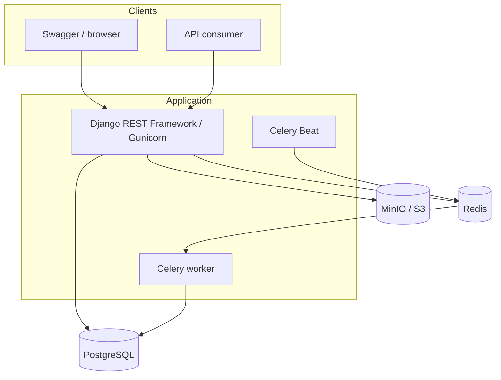
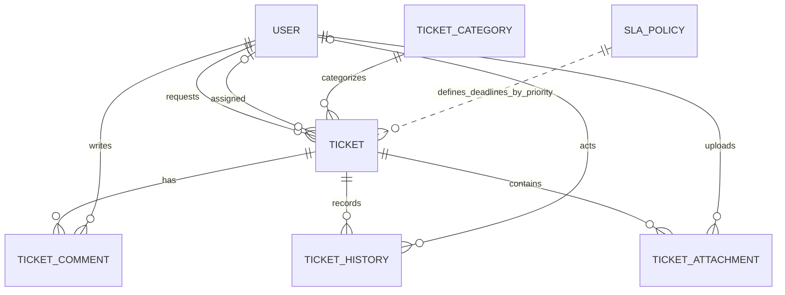
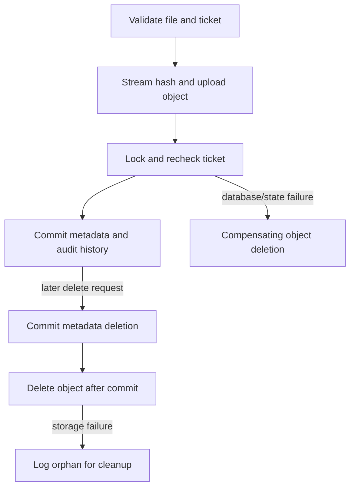

# ServiceFlow API Architecture

This document explains the boundaries and engineering decisions behind ServiceFlow API v1.0.0.
The README remains the onboarding entry point; this page provides deeper technical context.

## System Shape

ServiceFlow API is a modular Django monolith. Authentication and ticket management live in
separate Django apps, while one deployment unit owns the HTTP API and domain services. PostgreSQL,
Redis, Celery, and S3-compatible storage remain external infrastructure dependencies.

This shape is intentional:

- the current domain has cohesive transactional boundaries;
- one deployable application keeps operational complexity proportionate;
- Django apps separate responsibilities without network boundaries;
- explicit services make future extraction possible if ownership or scale demands it.

Microservices would introduce distributed transactions, deployment coordination, and additional
observability requirements without solving a demonstrated constraint at this stage.

## Runtime Components

Redis serves three distinct roles in local deployment: Celery broker/result backend, Django cache,
and throttling storage. PostgreSQL is the system of record. MinIO provides a private local
implementation of the S3 adapter used for attachment binaries.

## Domain Relationships

`SLAPolicy` is resolved by priority when creating or reprioritizing a ticket; tickets persist the
resulting deadlines rather than holding a foreign key to a mutable policy.

## Request Lifecycle

1. `RequestObservabilityMiddleware` validates or creates `X-Request-ID` and starts a monotonic timer.
2. DRF authenticates the JWT and applies global or endpoint-specific throttling.
3. The base ticket queryset enforces requester isolation before object lookup.
4. Serializers validate transport-level input; domain services enforce workflow invariants.
5. State-changing services open `transaction.atomic()` and lock the ticket when races matter.
6. Domain state and `TicketHistory` are written in the same PostgreSQL transaction.
7. `transaction.on_commit()` publishes notification work only after a successful commit.
8. The response and structured completion log carry the same request ID.

Unexpected API errors are sanitized outside debug mode. Request bodies, authorization headers,
cookies, and storage secrets are excluded from structured logs.

## Ticket Service Layer

Views do not directly implement assignment or transition rules. `apps/tickets/services.py` owns
ticket creation, safe updates, assignment, take ownership, transitions, comments, and the audit
records associated with them. This makes business rules callable from HTTP views, tests, and tasks
without hiding important behavior in model signals.

The service layer is deliberately explicit rather than a generic repository abstraction. Django's
ORM already provides persistence abstraction; the added layer exists for domain orchestration and
transaction boundaries.

## Transaction and Concurrency Strategy

### `transaction.atomic()`

State changes and their audit records succeed or fail together. A transition cannot be persisted
without its history entry, and a failed operation does not leave a partial workflow mutation.

### `select_for_update()`

Assignment, transitions, comments that complete SLA response, and breach checks lock the relevant
ticket row. This serializes competing decisions around the same ticket and prevents two agents from
silently taking ownership based on stale state.

### `transaction.on_commit()`

Celery publication occurs only after PostgreSQL commits. This avoids workers observing rolled-back
or nonexistent state. Broker publication failure is logged and does not pretend the committed
business operation failed. Guaranteed delivery would require a transactional outbox, which remains
an explicit limitation.

## SLA Design

One active `SLAPolicy` per priority defines first-response and resolution durations. On ticket
creation, calculated timestamps are stored directly on the ticket. This preserves the commitment
that was active at creation even when administrators later edit a policy.

An explicit priority change is treated as a new business decision and recalculates deadlines from
the original creation timestamp. The first agent/admin comment completes first response;
`first_resolved_at` records the first-ever resolution separately from the current `resolved_at`.

Celery Beat publishes a periodic scan. Candidate selection happens in SQL, then each candidate is
locked and rechecked. A breach timestamp is written only when still empty, which makes repeated or
overlapping task execution idempotent at the domain level.

## Attachment Consistency

PostgreSQL owns metadata and authorization relationships; S3-compatible storage owns bytes. The
systems cannot participate in one ACID transaction, so consistency is handled explicitly:

Object keys are UUID-based and never derived from untrusted paths. Original names remain metadata.
Downloads require an authorized API action that returns a short-lived presigned URL.

## Observability and Async Correlation

Request correlation uses `ContextVar`, avoiding mutable global request state. The publisher adds the
current ID to Celery headers. Worker signals restore it before task execution and clear it afterward;
periodic tasks receive generated IDs. Application and Celery logs therefore share one correlation
key across process boundaries.

HTTP completion events include method, path, status, duration, and authenticated user ID. Task
events include task name, task ID, state, and ticket event where applicable.

## Failure and Readiness Model

- PostgreSQL is essential to readiness; failure returns HTTP 503.
- Redis failure degrades readiness but returns HTTP 200 so non-cache-dependent traffic can continue.
- Throttling fails open during Redis outages and emits operational evidence through degraded health.
- S3 failures are sanitized as service-unavailable domain errors.
- MinIO and Celery are not readiness dependencies because unrelated synchronous routes can operate.

These choices prioritize API availability while making degraded protection and asynchronous
delivery visible to operators.

## Query Efficiency

Ticket list querysets join requester, assignee, and category and annotate attachment counts. A
regression test creates 30 tickets and caps a 20-item page at four queries; the measured path uses
two. Composite indexes cover common status/priority plus newest-first access patterns, while SLA
deadline columns retain dedicated indexes for overdue candidate selection.

## Engineering Decisions

### Modular monolith over premature services

The domain shares transactions and one team-sized operational boundary. Modules provide separation
without distributed-system overhead.

### Explicit services over model signals

Workflow effects are visible at call sites and easy to test. Signals are reserved for infrastructure
integration such as Celery lifecycle correlation, not hidden business mutations.

### Frozen deadlines over mutable policy references

Persisted timestamps preserve historical commitments and make SLA reporting deterministic.

### PostgreSQL metadata and S3 binaries

Relational authorization/audit data stays queryable while large binary objects use purpose-built
storage. Compensating actions acknowledge the cross-system consistency boundary.

### Post-commit async side effects

Workers never receive work for rolled-back transactions. The tradeoff is an acknowledged delivery
gap until a transactional outbox is introduced.

### Public UUIDs and internal integer keys

UUIDs reduce enumeration risk at the API boundary; compact database primary keys retain efficient
joins. Authorization remains mandatory because UUIDs are not a substitute for access control.

### Query budgets as regression tests

The suite protects relationship loading behavior from accidental N+1 regressions rather than
relying only on one-time manual profiling.
